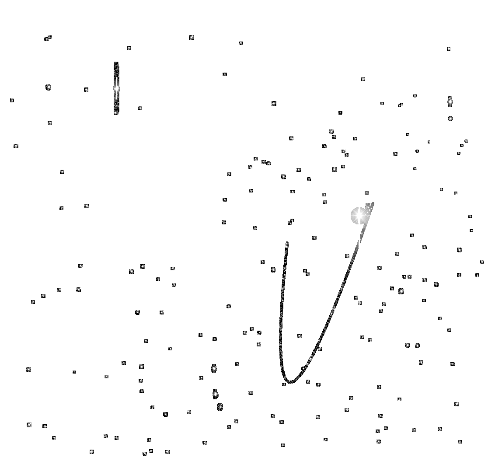

Example: Pluto mosaic
=====================

The K2 mission observed Pluto 
on CCD channel #65 during Campaign 7.
The observed pixels are available
as a series of *Target Pixel Files* (TPFs)
from the `K2 archive <https://archive.stsci.edu/missions/k2/target_pixel_files/>`_,
each covering only a part of Pluto's trajectory.
This basic example shows how you can identify
and mosaic the TPFs to obtain a single image of Pluto's track
and the surrounding stars.

First we need to create a list of the TPFs we wish to mosaic,
This can be done using the ``k2mosaic list`` command,
which takes a campaign and channel number as argument
and queries the archive to determine the URLs
of all the pixel files we need.
In our case we are interested in Campaign 7, channel 65::

    $ k2mosaic tpflist 7 65 > list-of-target-pixel-files.txt

You can then then pass this list to the ``k2mosaic mosaic`` tool,
which takes the list as argument.
We use the ``--cadence last`` option to specify
that we only wish to mosaic the final cadence of the Campaign::

    $ k2mosaic mosaic list-of-target-pixel-files.txt --cadence last

This command will download all the required TPFs
(hundreds of MBs) 
and produce a FITS image called ``k2mosaic-c07-ch65-cad119456.fits``.

You can then open this file using your favourite FITS image viewer,
or you can create a quicklook png image using the ``fits2bitmap`` tool
which is added to the command-line by AstroPy::

    $ fits2bitmap  k2mosaic-c07-ch65-cad119456.fits --scale log --min_cut 1 --max_cut 20000

The output shows an arc, which are the pixels which the Kepler
spacecraft stored to cover the trajectory of Pluto
during the Campaign:

